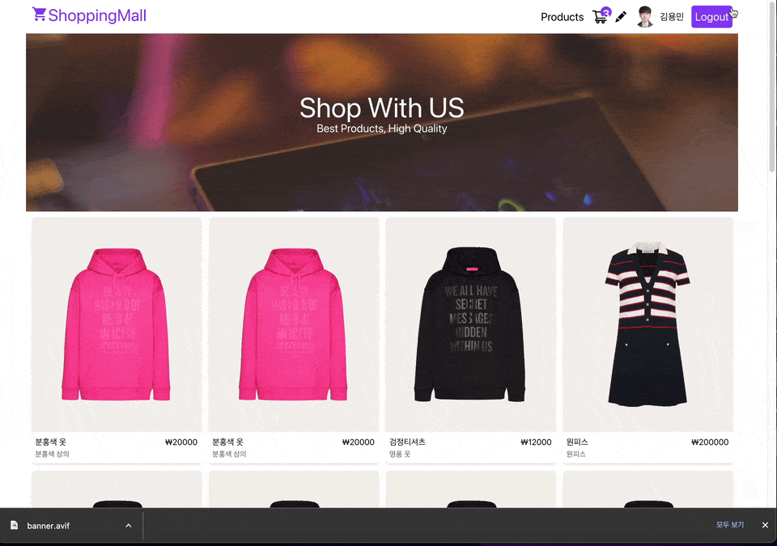

# 🛒 ShoppingMall 프로젝트

---

## 🛒 ShoppingMall 앱 실행 방법

### 실행 방법

`yarn start`를 통해 프로젝트를 시작할 수 있습니다.

### 🛒 ShoppingMall 사용해보기

아래의 링크에서 실제 작동되는 App을 확인할 수 있습니다.

[🛒 ShoppingMall 사용해보기](https://effulgent-youtiao-b6a85c.netlify.app/)

---

# 프로젝트 파일 구조

```js
📦src
 ┣ 📂api
 ┃ ┣ 📜firebase.js
 ┃ ┗ 📜upload.js
 ┣ 📂components
 ┃ ┣ 📂ui
 ┃ ┃ ┣ 📜Button.jsx
 ┃ ┃ ┗ 📜CartStatus.jsx
 ┃ ┣ 📜Banner.jsx
 ┃ ┣ 📜CartItems.jsx
 ┃ ┣ 📜Header.jsx
 ┃ ┣ 📜PriceCard.jsx
 ┃ ┣ 📜ProductCard.jsx
 ┃ ┣ 📜Products.jsx
 ┃ ┗ 📜User.jsx
 ┣ 📂context
 ┃ ┗ 📜UserContext.jsx
 ┣ 📂hooks
 ┃ ┣ 📜useCarts.jsx
 ┃ ┗ 📜useProducts.jsx
 ┣ 📂images
 ┃ ┗ 📜banner.avif
 ┣ 📂pages
 ┃ ┣ 📜AllProducts.jsx
 ┃ ┣ 📜ErrorPage.jsx
 ┃ ┣ 📜Home.jsx
 ┃ ┣ 📜NewProducts.jsx
 ┃ ┣ 📜ProductDetail.jsx
 ┃ ┣ 📜ProtectedRoute.jsx
 ┃ ┗ 📜ShoppingCart.jsx
 ┣ 📜App.css
 ┣ 📜App.js
 ┣ 📜App.test.js
 ┣ 📜index.css
 ┣ 📜index.js
 ┣ 📜logo.svg
 ┣ 📜reportWebVitals.js
 ┗ 📜setupTests.js
```

---

### Commit Message Convention

`feat`: 기능 추가, 삭제, 변경

`fix`: 버그 수정

`docs`: 문서 추가, 삭제, 변경 - 코드 수정없음

`style`: 코드 형식, 정렬, 주석 등의 변경
(세미콜론 추가 같은 코드 수정이 있으나, 기능에 변동 X)

`refactor`: 코드 리펙토링 (변수명, JS -> TS)

`test`: 테스트 코드 추가, 삭제, 변경 등

`chore`: 위에 해당하지 않는 모든 변경, eg. 빌드 스크립트 수정, 패키지 배포 설정 변경

---

### 🛒 ShoppingMall 앱 핵심 기능

- [x] `Products` 클릭 시, 전체 상품 보기 기능
- [x] `Shopping Cart` 클릭 시, 로그인 하지 않은 사용자는 Home으로, 로그인 한 사용자는 장바구니 기능 이용 가능! `protectedRoute` 구현
- [x] `Firebase`를 활용하여 로그인 기능 구현
- [x] `장바구니에 추가` 클릭 시, 장바구니에서 확인가능, 아이콘에 몇개 들어가있는지 실시간 UI상으로 확인 가능!
- [x] `제품 별 사이즈` 옵션 기능 추가!
- [x] `상품 총액, 배송비, 총가격`등 제품별 가격에 맞춰서 유동적으로 계산해주는 기능. 장바구니에서 수량 올릴시 실시간으로 변경이 가능하고, 장바구니에 있는 상품 삭제도 가능
- [x] 이전에 추가해놓은 장바구니 상품을 `Firebase`에 기록하여 확인가능!
- [x] `Admin` 계정은 새로운 제품을 등록할 수 있다.
- [x] `Cloudinary` 서비스를 이용하여 이미지 업로드!
- [x] `firebase` 데이터 읽고 쓰기 구현!
- [x] `react-query`의 invalidateQueries를 활용하여, 새로 fetch된 데이터로 변경 및, useMutation 데이터를 update/delete 해 줌.
- [x] `비즈니스 로직`과 `컴포넌트` 분리 `hooks/api` 폴더에 파일 관리하여 리팩토링 진행!
- [x] `netlify` 배포

---

### 🛒 ShoppingMall기능 실행 영상!



---

### Trouble Shooting 🛠️

`🛒 ShoppingMall` 프로젝트를 진행하면서 발생한 `버그 수정`, `문제 해결`, 기능 구현시 `어려웠던 점 정리`, `성능 개선`, `작업 효율 향상` 들에 관해 정리한 기록입니다.

[프로젝트를 진행시 배운점들 정리](https://www.notion.so/ShoppingMall-7f5937aef13c4c1abf9985edda88554a?pvs=4)

---

### 느낀점...!

여러 유용한 기능들을 배웠다. 디자인 상으로는 크게 신경안쓰고, 성능 개선 및 기능 구현을 중점으로 학습하였다. 이 지식들을 활용하여, 조금 더 디자인에 신경 쓴 쇼핑몰 앱을 만들어볼 것이다.

---

### 버그 발생시 ☎️

연락 부탁드립니다. 더욱 좋은 코드 리팩토링 방향성이 있어도 연락 주시면 감사하겠습니다!
<dydals3440@gmail.com>
